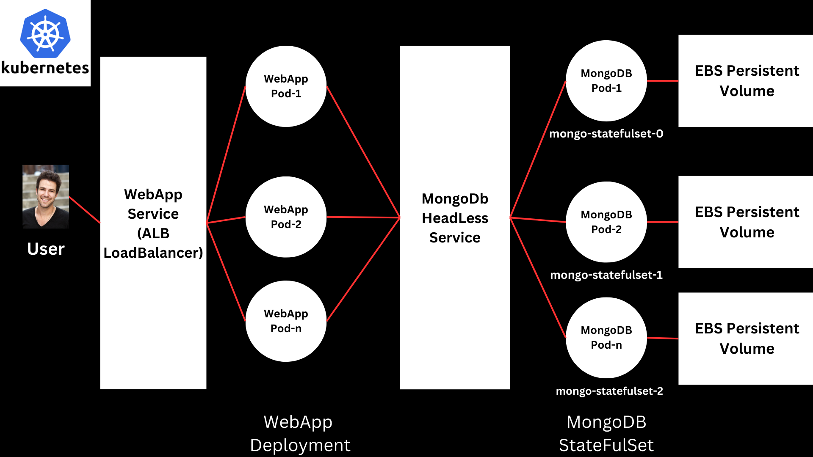

## Kubernetes Configuration for Deploying a MERN App

To deploy your MERN (MongoDB, Express.js, React.js, Node.js) application in  Kubernetes Cluster on AWS, follow the steps below:

**Architecture Diagram:**



### Configure AWS EKS Cluster

### Step 1: Install Git 
  `yum install git -y`

### Step 2: Clone the Repository
  `git clone https://github.com/sudhanshuvlog/K8s-MERN-App-Deployment.git`

### Step 3: Configure AWS Credentials
  `aws configure` Make sure you have created your credentials in the AWS IAM service.

### Step 4: Install eksctl
  eksctl is a simple CLI tool for creating and managing EKS clusters. Install eksctl using the following commands:

  ``` bash 
  curl --silent --location "https://github.com/weaveworks/eksctl/releases/latest/download/eksctl_$(uname -s)_amd64.tar.gz" | tar xz -C /tmp
  sudo mv /tmp/eksctl /usr/local/bin
  eksctl version
  ```
### Step 5: Install kubectl
  kubectl is a command-line tool used to interact with Kubernetes clusters. Install it to manage your EKS cluster:

  ````bash
  curl -o kubectl https://amazon-eks.s3.us-west-2.amazonaws.com/1.19.6/2021-01-05/bin/linux/amd64/kubectl
  chmod +x ./kubectl
  sudo mv ./kubectl /usr/local/bin
  kubectl version --short --client
  ````

### Step 6: Create the EKS Cluster
  The following command creates a new EKS cluster named EKS-1 in the ap-south-1 region. No worker nodes will be created at this stage.

  ```bash
  eksctl create cluster --name=EKS-1 \
                        --region=ap-south-1 \
                        --zones=ap-south-1a,ap-south-1b \
                        --without-nodegroup
  ```

### Step 7: Associate IAM OIDC Provider 
  EKS clusters need to associate with an IAM OIDC provider for enabling fine-grained access controls. This step ensures that IAM roles can be used to provide permissions to our Kubernetes service accounts.

  ```bash
  eksctl utils associate-iam-oidc-provider \
      --region ap-south-1 \
      --cluster EKS-1 \
      --approve
  ```

### Step 8: Create a Node Group
  Now create a node group, which provisions the worker nodes for the EKS cluster. The following command creates a managed node group with 2 t3.medium instances, allowing SSH access with my `DevOps` key pair.

  ```bash
  eksctl create nodegroup --cluster=EKS-1 \
                        --region=ap-south-1 \
                        --name=node2 \
                        --node-type=t3.medium \
                        --nodes=2 \
                        --nodes-min=2 \
                        --nodes-max=2 \
                        --node-volume-size=20 \
                        --ssh-access \
                        --ssh-public-key=DevOps \
                        --managed \
                        --asg-access \
                        --external-dns-access \
                        --full-ecr-access \
                        --appmesh-access \
                        --alb-ingress-access
  ```

### Step 9: Create an IAM Policy Create an IAM Policy with the below access
  An IAM policy with the following permissions allows EKS to attach, create, delete, and describe volumes.
  ```json
  {
      "Version": "2012-10-17",
      "Statement": [
          {
              "Effect": "Allow",
              "Action": [
                  "ec2:AttachVolume",
                  "ec2:CreateSnapshot",
                  "ec2:CreateTags",
                  "ec2:CreateVolume",
                  "ec2:DeleteSnapshot",
                  "ec2:DeleteTags",
                  "ec2:DeleteVolume",
                  "ec2:DescribeInstances",
                  "ec2:DescribeSnapshots",
                  "ec2:DescribeTags",
                  "ec2:DescribeVolumes",
                  "ec2:DetachVolume"
              ],
              "Resource": "*"
          }
      ]
  }
  ```

  To attach the policy, describe the `aws-auth` config map and apply the necessary roles.
  ```bash
  kubectl -n kube-system describe configmap aws-auth
  ```
  go to the role and attach the policy created above.

### Step 10: Deploy AWS EBS CSI Driver
  Deploy the AWS EBS CSI Driver to enable dynamic volume provisioning on your EKS cluster.
  ```bash
  kubectl apply -k "github.com/kubernetes-sigs/aws-ebs-csi-driver/deploy/kubernetes/overlays/stable/ecr/?ref=release-1.4"
  ```

### Step 11: Deploy MongoDB and MERN Web App

### Create Kubernetes Secret for MongoDB Credentials
`kubectl apply -f secret.yml` 
### Create Storageclass for EBS PV Provisioning
`kubectl apply -f storageclass.yml`
### Create the MongoDB Statefulset
`kubectl apply -f mongo-app.yml`
### Expose MongoDB Service on ClusterIP (Internal Cluster Access Only)
`kubectl apply -f mongo-service.yml`
### Create ConfigMap for MongoDB URL, Pointing to the MongoDB Service
`kubectl apply -f mongo-config.yml`
### Create the mongo-express Deployment with ReplicaSet, It uses the secrets and ConfigMap created above
`kubectl apply -f mongo-express-webapp.yml`
### Expose Webapp Service With LoadBalancer
`kubectl apply -f webapp-service.yml`

* Our Mongo-Express web app, built using Express, Node.js and MongoDB, is now accessible by AWS ALB, You can get the Loadbalancer DNS and hit to the website `kubectl get svc`


## Mern Application on Kubernetes

**Objective:**

- To deploy a MERN stack application using Kubernetes components like StatefulSets, Deployments, Persistent Volumes (PV), Persistent Volume Claims (PVC), Services, Secrets, and ConfigMaps. 

### What is MERN?

- MERN is a full-stack JavaScript solution that facilitates the building of modern web applications using four core technologies:
  - MongoDB: NoSQL database.
  - Express.js: Web application framework for Node.js.
  - React.js: Frontend library.
  - Node.js: JavaScript runtime for backend.

### Mern Application

- Frontend/Backend: The application uses the image mongo-express:latest which provides a web-based  interface for MongoDB management.
- Database: MongoDB, using the image `mongo:5.0`, to manage and store the application’s data.

In this setup:

- We will deploy MongoDB using a StatefulSet to ensure persistent storage and unique identities for each pod.
- The mongo-express (frontend/backend) will be deployed via a Deployment, which will automatically recreate pods if they go down.

1. Frontend/Backend Deployment:

  - Deployment Type: Used for mongo-express to manage the lifecycle of pods.
  - Resilience: Deployments ensure automatic pod replacement if any instance fails.

2. Database StatefulSet:

  - MongoDB Deployment: Uses a StatefulSet to maintain stable storage and unique pod identities.
  - ClusterIP Service: Exposes MongoDB as an internal service for communication within the cluster.
  - Secrets & ConfigMaps: Secrets will store sensitive data like usernames/passwords, while ConfigMaps will hold non-sensitive configuration data such as database URLs.
  - Persistent Storage: Uses PV and PVC to ensure data persistence even if pods are recreated.


References:

- [Kubernetes](https://kubernetes.io/docs/home/)
- [MongoDB](https://www.mongodb.com/)
- [Mongo-Express](https://www.npmjs.com/package/mongo-express)    
- [Kubernetes Secrets](https://kubernetes.io/docs/concepts/configuration/secret/)
- [Kubernetes ConfigMap](https://kubernetes.io/docs/concepts/configuration/configmap/)
- [Kubernetes PersistentVolume](https://kubernetes.io/docs/concepts/storage/persistent-volumes/)
- [Kubernetes PersistentVolumeClaim](https://kubernetes.io/docs/concepts/storage/persistent-volumes/#persistentvolumeclaims)
- [Kubernetes Services](https://kubernetes.io/docs/concepts/services-networking/service/)
- [Kubernetes Deployments](https://kubernetes.io/docs/concepts/workloads/controllers/deployment/)
- [Kubernetes Pods](https://kubernetes.io/docs/concepts/workloads/pods/pod/)
- [Kubernetes Volumes](https://kubernetes.io/docs/concepts/storage/volumes/)
- [Kubernetes NodePort](https://kubernetes.io/docs/concepts/services-networking/service/#nodeport)
- [Kubernetes ClusterIP](https://kubernetes.io/docs/concepts/services-networking/service/#clusterip)
- [Kubernetes Minikube](https://minikube.sigs.k8s.io/docs/start/)
- [Kubernetes Kubectl](https://kubernetes.io/docs/reference/kubectl/overview/)

